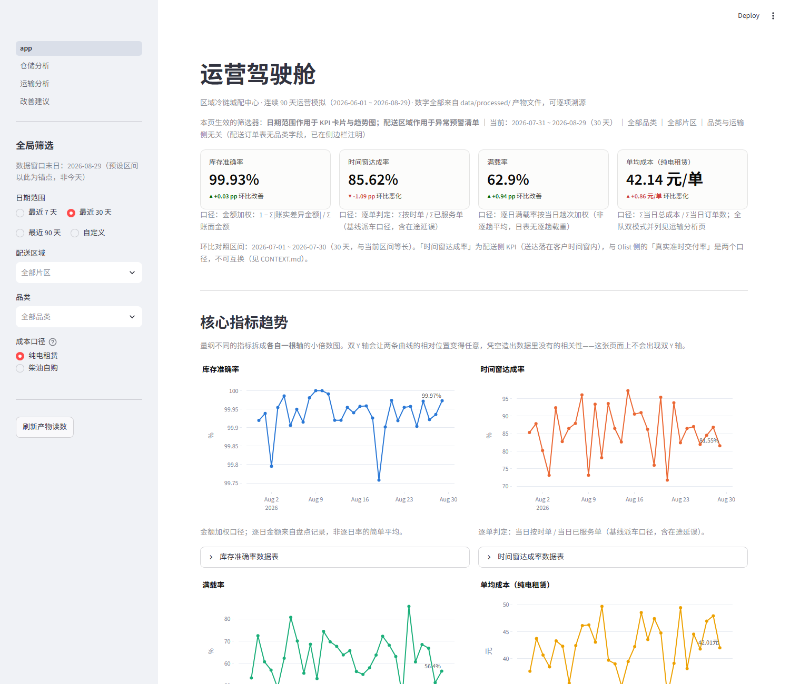
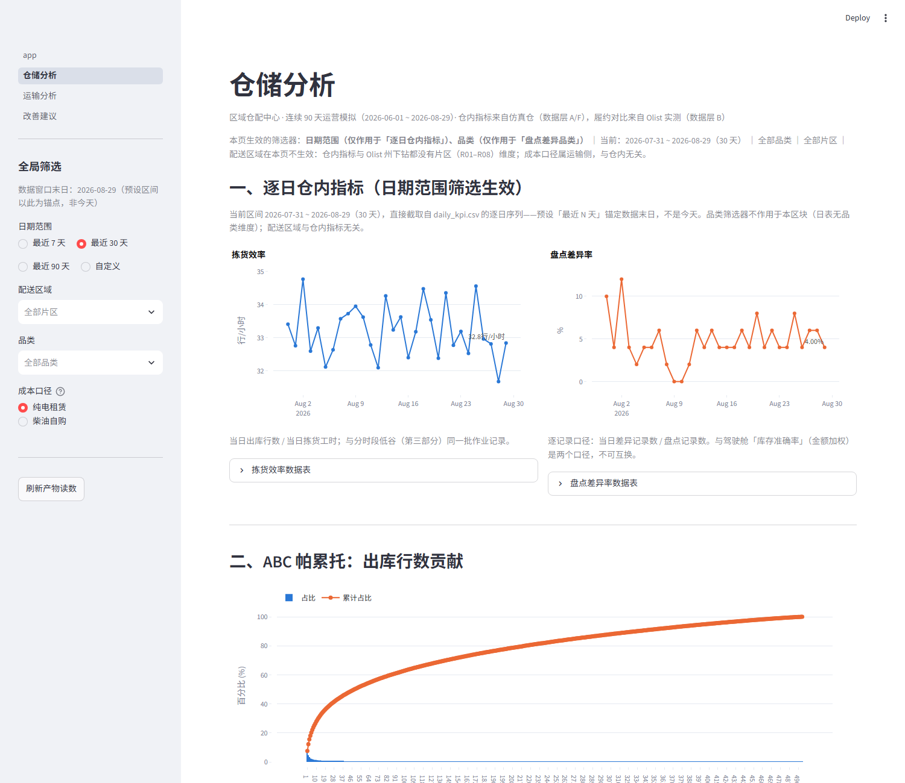
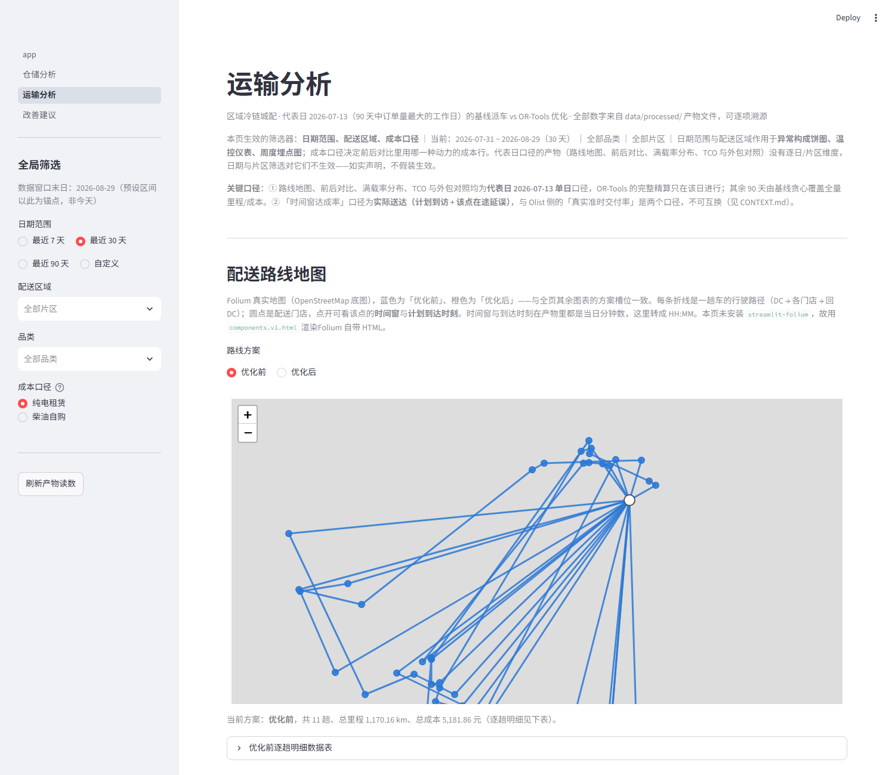
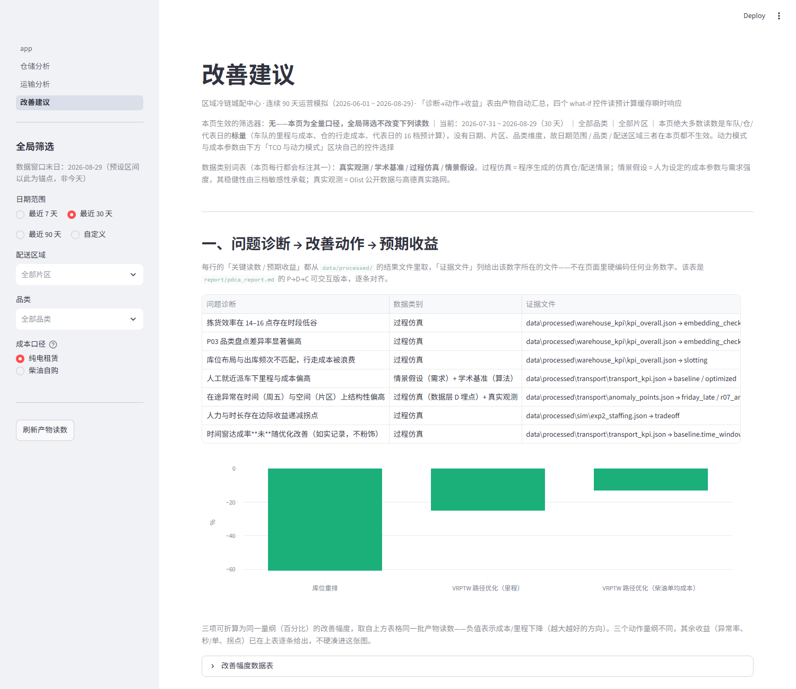

# 区域仓配中心运营数据分析与配送路径优化

`cold-chain-ops-analytics` —— 面向物流 / 供应链运营岗位的求职作品集工程。以「真实电商订单 + 真实地理路网 + 学术标准算例 + 仓内过程仿真」四类数据为底座，模拟某区域冷链城配中心连续 90 天的仓储与配送运营，走通：

> 多源数据获取与生成 → 仓储运营分析 → 仓内作业仿真对照 → 运输调度优化 → Streamlit 看板 → PDCA 改善报告 → 部署与复现整理。

**最高原则——数据四层分类**：每个数字都标注其性质（真实观测 / 学术基准 / 过程仿真 / 情景假设），可在《数据来源与参数标定台账》追溯，禁止把仿真 / 假设表述为真实观测。详见 [`CONTEXT.md`](CONTEXT.md)。

---

## 一键复现（五步）

> 占位骨架——各步骤的可执行细节随对应模块票（见下）落地后补全。

### 1. 装依赖

```bash
python -m venv .venv
# Windows: .venv\Scripts\activate    |  macOS/Linux: source .venv/bin/activate
python -m pip install -r requirements.txt
```

环境基线：Python 3.14.6、pandas 2.3.3（见 [`docs/adr/0006-python314-pandas233.md`](docs/adr/0006-python314-pandas233.md)）。

### 2. 备数据

- **Olist 九表**：已预置于 `data/raw/olist/`（亦保留「本地→kagglehub→报错指引」三段式自动获取）。
- **高德密钥**（可选）：`cp .env.example .env` 并填入 `AMAP_KEY`。无密钥时数据层 C 自动降级 OSMnx，或直接用仓库预置的 `data/geo/` 缓存矩阵复现。
- **Solomon 算例**：由数据层 E 自动下载到 `data/raw/solomon/`。

### 3. 跑数据层

按门禁顺序执行数据层脚本（A 仓内仿真 → B Olist 清洗 → C 高德地理 → D 配送情景 → E Solomon 门禁 → F SimPy 仿真）。

```bash
python -m src.gen_warehouse_data     # A 仓内仿真五表
python -m src.olist_clean            # B Olist 清洗 + 分布/延迟率
python -m src.geo_poi                # C POI 抓取（无密钥走缓存）
python -m src.geo_matrix             # C 路网矩阵（无密钥走缓存）
python -m src.gen_delivery_data      # D 配送订单 / 车辆 / 在途异常
python -m src.solomon_validate       # E Solomon 算法门禁（gap>10% 不放行）
python -m src.warehouse_sim          # F SimPy 双实验 + 预计算缓存
```

### 4. 算指标

```bash
python -m src.olist_kpi              # Olist 真实履约 KPI
python -m src.warehouse_kpi          # 模块一：仓内 KPI / ABC / 库位重排
python -m src.transport_optimize     # 模块二（上）：基线 vs VRPTW 优化核心（约 35 秒）
python -m src.transport_decisions    # 模块二（下）：周度复盘 / TCO / what-if 16 档预计算（约 8 分钟）
```

> 顺序有依赖：`transport_decisions` 读 `transport_optimize` 的落盘产物作「优化前后」口径的
> 唯一来源（ADR-0013），先跑前者会直接报错并提示运行顺序。what-if 预计算是 16 档的离线
> 一次性成本（约 1.5 分钟），换来改善建议页滑块零等待（ADR-0010）；只想快速验证可用
> `python -m src.transport_decisions --whatif-seconds 1` 压缩耗时。
>
> 求解的停止条件是**解数**（`config.VRPTW_SOLUTION_LIMIT`）而不是秒数，`--whatif-seconds`
> 与 `VRPTW_TIME_LIMIT_SEC` 都是**墙钟安全网**：正常路径不会碰到它们。这样同一个输入每次
> 求解结果一致；换成「跑满 N 秒」则会让结果随机器负载漂移（ADR-0015）。

### 5. 启看板

```bash
streamlit run app.py
```

看板入口即运营驾驶舱（`app.py`），三张子页在 `pages/` 下，由 Streamlit 自动挂载。
页面读数一律来自 `data/processed/` 产物，**缺产物会直接列出该跑哪条命令并停下**，
不会用 0 或空图冒充「今天没有异常」。

---

## 结果截图

| 页面 | 截图 |
|---|---|
| 运营驾驶舱（KPI 卡片带环比、四张趋势小倍数图、异常预警） |  |
| 仓储分析（ABC 帕累托、分时段拣货效率、库位频次热力图、盘差 Top10、Olist 履约、仿真对照） |  |
| 运输分析（Folium 路线地图、前后对比、满载率分布、异常周趋势、温控仪表、TCO 曲线） |  |
| 改善建议（诊断→动作→收益表、车辆数/ABC 阈值/人力/动力模式四组 what-if 控件） |  |

报告成品见 [`report/pdca_report.pdf`](report/pdca_report.pdf)（10 页，中文，由 `report/build_pdf.py` 生成）。

---

## 目录结构

```
project/
├── data/
│   ├── raw/            # Olist 原始 9 表、Solomon 算例（大文件不提交，见 .gitignore）
│   ├── warehouse/      # 数据层 A：仓内仿真表
│   ├── geo/            # 数据层 C：POI、距离/时间矩阵缓存（提交，供无密钥复现）
│   ├── delivery/       # 数据层 D：配送订单、车辆、在途异常
│   └── processed/      # 全部 KPI、对照实验、优化结果（报告数字溯源依据）
├── src/                # 数据层与模块脚本 + config.py（集中配置）+ dashboard/（看板基建）
├── app.py              # 看板入口（运营驾驶舱）
├── pages/              # 仓储分析、运输分析、改善建议三个子页
├── .claude/launch.json # 本地预览启动配置（streamlit run app.py）
├── report/             # PDCA 报告 md / pdf
├── tests/              # KPI 与 config 单元测试
├── data_sources_ledger.md   # 数据来源与参数标定台账
├── CONTEXT.md          # 领域术语表
├── docs/adr/           # 架构决策记录 0001–0014
├── .env.example        # AMAP_KEY= 模板
├── requirements.txt    # 依赖锁定
└── README.md
```

---

## Streamlit Community Cloud 部署

看板是标准的多页 Streamlit 应用，可直接部署到 Community Cloud（免费档即可）：

1. **把仓库推到 GitHub**（`data/raw/` 与 `archive/` 等大文件按 `.gitignore` 排除；
   `data/geo/` 的缓存矩阵与 `data/processed/` 的产物**应当提交**——前者让无密钥复现者免于调 API，
   后者是看板与报告全部数字的来源）。
2. 在 <https://share.streamlit.io> 选 **New app** → 连接仓库 → **Main file path 填 `app.py`**
   → Python 版本选 **3.14**（`runtimes.txt` 或应用设置里指定）。
3. **依赖自动读 `requirements.txt`**（已锁全版本）。若平台未预装 3.14，改用本仓库的
   `docs/adr/0006-python314-pandas233.md` 记录的备选版本组合。
4. **密钥配置（st.secrets）**：看板本身**不需要任何密钥**（全部读数来自已落盘的缓存与产物）。
   只有在云上重跑数据层 C 时才需要高德 key，此时在 **App settings → Secrets** 里填：

   ```toml
   AMAP_KEY = "你的高德 Web 服务 key"
   ```

   本地开发用 `.env`（从 `.env.example` 复制），云上走 `st.secrets`——`src/geo_poi.py`
   与 `src/geo_matrix.py` 两处读取，均**不落盘、不打印、不提交**。
5. 部署后首次打开即为运营驾驶舱；三张子页由 Streamlit 自动挂载在侧边栏。

> **无网络/无密钥的复现者**：直接用仓库预置的 `data/geo/` 缓存与 `data/processed/` 产物，
> 跳过需要联网的数据层 B/C，其余步骤照常——见上一节第 2 步。

---

## 设计与决策文档

- [`CONTEXT.md`](CONTEXT.md)：领域术语表（数据四层分类、真实准时交付率 vs 时间窗达成率、ABC 分类、冷链城配、需求聚合、代表日等）。
- [`docs/adr/`](docs/adr/)：十四条架构决策（0001 仿真校准 · 0002 ABC 数据源 · 0003 代表日 · 0004 需求聚合 · 0005 冷链设定 · 0006 Python/pandas 版本 · 0007 PDF 方案 · 0008 高德矩阵 · 0009 成本参数溯源 · 0010 what-if 预计算 · 0011 看板图表库 · 0012 去掉 Excel 校验簿 · 0013 运输 TCO 口径 · 0014 看板逐日序列）。
- [`data_sources_ledger.md`](data_sources_ledger.md)：数据来源与参数标定台账（持续维护）。
- [`.scratch/dc-ops-analytics/`](.scratch/dc-ops-analytics/)：PRD（spec.md）与实现票（issues/01–17）。

## 实施进度

| 票 | 内容 | 状态 |
|---|---|---|
| 01 | 工程骨架 + 共享 config | ✅ 完成 |
| 02–07 | 数据层 A/B/C/D/E/F | ✅ 完成 |
| 08–09 | 模块一：仓储运营分析 + Olist 履约 KPI | ✅ 完成 |
| 10–11 | 模块二：运输优化核心 + 周度复盘/TCO/what-if | ✅ 完成 |
| 12 | 模块三：看板基建 + 运营驾驶舱 | ✅ 完成 |
| 13–15 | 模块三：仓储分析页 / 运输分析页 / 改善建议页 | ✅ 完成 |
| 16 | 模块四：PDCA 报告（Markdown + PDF） | ✅ 完成 |
| 17 | 收口：台账回填 + README + DoD 全项验收 | ✅ 完成 |

完整票面与验收清单见 [`.scratch/dc-ops-analytics/issues/`](.scratch/dc-ops-analytics/issues/)。
